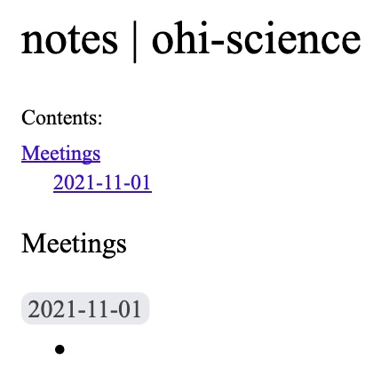

```{r setup, include=F}
knitr::opts_chunk$set(echo = F)
```

# Learning Objectives {-}

-   **Notetaking**. Use Google Docs to keep quick flexible notes as you proceed with meetings using headers and table of contents.

-   **Tasks**. Break down your project into tasks.

-   **Schedule of Tasks**. Create a simple schedule in Google Sheets using cells as units of time. Create a detailed Google Chart pulling from specific dates in a Google Sheet.

-   **Schedule of Deliverables**. Create a table of deliverables with due date and amount based on schedule of tasks, estimated hours and an hourly rate.

-   **RFP and Proposal**. Write a simple Request for Proposal and a responding Proposal with core elements for submission.

# Create Group Project Key and Title

> There are only two hard things in Computer Science: cache invalidation and [**naming things**]{.ul}.\
> --- Phil Karlton (Netscape "Principal Curmudgeon"; 1947-1997)

Think carefully about what you'd like to call your group project. Come up with:

-   **Title**\
    camel case, with spaces\
    For instance, "Ocean Health Index".

-   **Key**\
    all lower case letters and numbers [a-z0-9], no spaces or special characters except dash "-" (underscore "_" not allowed), possibly an acronym\
    For instance, "ohi". Ideally, find a key that is not already taken on Github. Since [github.com/ohi](https://github.com/ohi) is already taken, we chose "[ohi-science](https://github.com/ohi-science)" as the final key. You don't need to create a new Github organization just yet. We'll handle that in the Github lab.

# Take Notes in Google Docs

1.  Have one of your project members **create a folder** named after the project's key name in Google Drive. **Share** this folder with all members and the instructor (ben\@ecoquants.com).

2.  Add a **Google Document** named "notes \| {key}" (swapping out {key} with your project's Key). (Note that adding the extra project key to the document name makes it show up in the browser tab, which differentiates it from other tabs with documents named simply "notes".) Add the same name to the top of the document formatted as **Title**. Add **Meetings** formatted as **Heading 1** and below that today's **date** in YYYY-MM-DD format as **Heading 2**. Between the title and first header add normal text "Contents:" and below that add **Table of Contents**. For reference, see: [Add a title, heading, or table of contents in a document - Computer - Docs Editors Help](https://support.google.com/docs/answer/116338?hl=en&co=GENIE.Platform%3DDesktop). Start the first bullet point. Your document should look similar to this:\
    {width="400"}

# Consider Tasks of your Project

Now consider the various Tasks of your project, such as: data acquisition, information extraction and cleaning, data integration, modeling, analysis, interpretation and deployment (@larsonBestPracticesAccelerating2019). Try to be as specific as you can. Write these down in your notes as a numbered list.

{width="500"}

# Create Simple Project Schedule

Your first Gantt chart will simply use cells horizontally as time.

1.  Create a new **Google Sheet** in your project Drive folder named "schedule \| {key}" (swapping out {key} with your project's Key). Name the tab "simple."

2.  Add columns "Task", dates "Nov 1", "Nov 8". Select "Nov 1" and "Nov 8" cells, then click the lower right blue box to drag and fill values to the end of the quarter, "Dec 6".

3.  Fill out the Tasks column with those specific to your project.

4.  Make the cell background gray for the estimated work period for each of the Tasks, whereby the start day is given by the column's date.

5.  Make the column headers bold and add border lines below the header and to the right of the Task column.

You simple Gantt chart should look similar to this:

{width="600"}

# Create Detailed Project Schedule

For more complex projects, you might want to display the project schedule with specific dates over time. To do this you'll create a Google Chart from Task data using dates.

1.  Create a new tab called "detailed" in the same "schedule \| {key}" Google Sheet. Copy the "Task" column from your "simple" tab to this new one.

2.  Add columns "Start Date" and "End Date". Fill out these dates per Task.

3.  Add columns "Start Day" and "Duration". Calculate the first of these fields according to the dates and fill down values for all Tasks:

    -   **Start Day**: `=int(B2)-int($B$2)`. This represents the number of days from the beginning of the project `$B$2` that the task starts. Notice how the dollar prefixes for cell `$B$2` continue to use the same fixed cell as values get filled down (vs `B2` changing to `C2`, `D2`, etc.).

    -   **Duration**: `=int(C2)-int(B2)`. This represents the number of days for each task.{width="600"}

4.  Move "Start Date" and "End Date" columns to the right of "Start Day" and "Duration".

5.  Select all cells within the "Task", "Start Day" and "Duration" columns including the headers. From the menu, choose *Insert* -\> *Chart*. It will default to a "Stacked bar chart".

6.  Configure the chart. In the *Chart editor* panel on the right, click the *Customize* tab. Click *Series*, then click the dropdown menu and *Start Day*. Enter 0% for *Fill opacity* to turn off display of this Series. The chart should now resemble a Gantt chart.

7.  Update the Chart and Axis Titles. Double-click on the title at the top of the chart. Type new title "Project Schedule". Customize the *Chart & axis titles* so the *Horizontal axis title* has "Day" for *Title text*.

8.  Remove the Chart Legend. Click on the chart and three circles in upper right, Edit chart. Click the *Customize* tab in the Chart editor panel, then click *Legend*. Select *Position: None*.

In the end, you should have a chart like so:

{width="600"}

# Create Schedule of Deliverables

1.  Create a new tab called "deliverables" in your "schedule \| {key}" Google Sheet.

2.  Add columns: Deliverable \| Date Due \| Amount \| Hours \| Hourly Rate. Make the first 3 column headers (Deliverable \| Date Due \| Amount) bold and add an underline to be used in the final table, whereas the Hours and Hourly Rate columns are only used to calculate the Amount.

3.  Populate the Deliverables and Date Due cells base on outputs from the schedule of Tasks.

4.  Enter the Hourly Rate of \$100 and estimate the number of hours it will take to complete each task here described as deliverables.

5.  Enter the first cell for the Amount using the equation [`=`]{.ul}`D2*$E$2` and fill down:\
    

# Write the RFP

Create a Google Document simply named RFP (Request for Proposal) with your project key, so "rfp \| {key}". Give it a title summarizing the desired output product and a new line below that with "Request for Proposal" formatted as a Subtitle. Imagine you are the client seeking the analytic output of your Remote Sensing group project. Write one paragraph describing this as a request to solicit bids from environmental data science consultancies.

# Write the Proposal

Create a Google Document named "proposal \| {key}". This is your environmental data science consultancy's response to the RFP bidding for the work.

Include in your proposal:

1.  **Title** same as RFP with subtitle Proposal.

2.  **Date** in the upper right.

3.  **Contents** with Table of Contents added, similar to Notes. Be sure to refresh the Table of Contents after you add the headers below.

4.  **Overview**. Below a Heading 1 of Overview, describe the project summarizing or expanding upon the RFP in a paragraph.

5.  **Schedule of Deliverables**. Paste your schedule of deliverables below a Heading 1 of "Schedule of Deliverables".

6.  **Work Schedule**. Include a detailed chart below a Heading 1 of "Work Schedule". Optional: Expand on each of the tasks with more details in paragraph form below the chart.

7.  **Team**. Below a Heading 1 of Team, provide a bulleted list of each team member with First Last (UCSB email address) and a one sentence description of relevant experience. Provide the rate for each team member as \$100/hour.

# Submit Lab via Form

***Every team member*** must submit links to the lab outputs via the following Google Form using your UCSB email:

-   [Submission for Lab 1. Proposal](https://forms.gle/VmgQyESQtGb6aodG8)


# Explore Further {.unnumbered}

- [What does an AI RFP need to contain? | by Bradley Arsenault | Towards Data Science](https://towardsdatascience.com/what-does-an-ai-rfp-need-to-contain-13c747b316ed)
