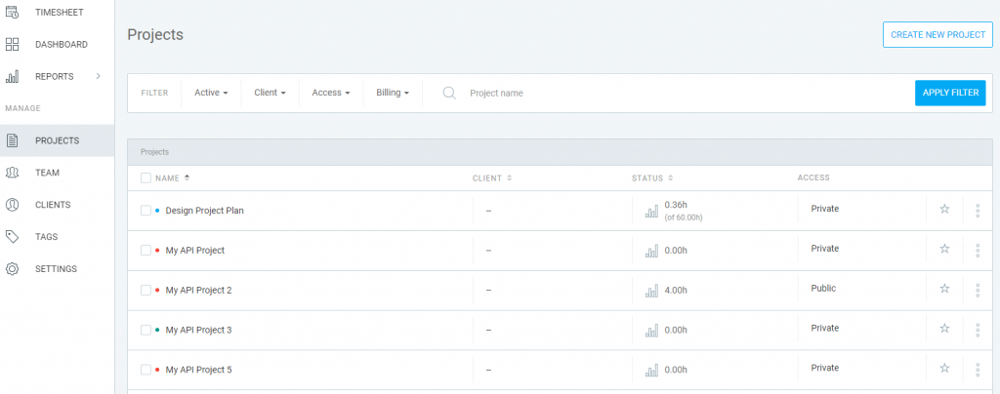
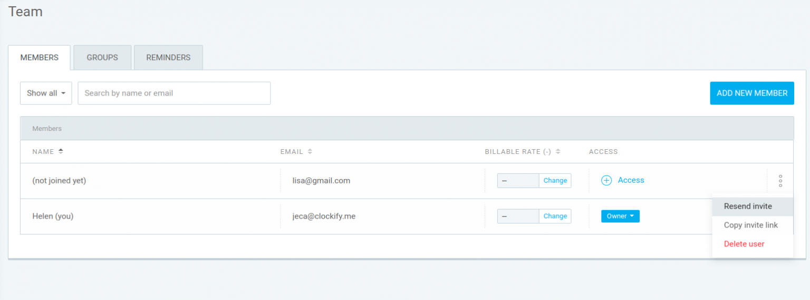

```{r setup, include=F}
knitr::opts_chunk$set(echo = F)
```

> Lost time is never found again. <br> -- Benjamin Franklin

# Learning Objectives {.unnumbered}

-   **Track Time with Clockify**. Time can be tracked in a simple spreadsheet, e.g. with columns: date, duration (hours), project, task and description. Even easier would be the ability to click a timer on and off with the ability to select project and task from a drop-down list and enter a textual description. For this timer app, we'll use [**clockify.me**](https://clockify.me) with the many features described in the [time lecture](https://docs.google.com/presentation/d/1t2GFvnEhKcWrs7lSHk29fdCZBhlqx3vjDe2gtKCnJ_U/edit?usp=sharing).

-   **Setup Project, Tasks, Team**. Setup your project with tasks, including estimated time, and team members.

-   **Enter Time Manually or with Timer**. Use any of the Clockify apps (web / browser extension / mobile app) to start and stop the timer, or enter time manually. Select the Project and Task before entering Description and possibly adding a Tag.

-   **Generate Project Reports**. Track progress of time spent on tasks, especially relative to initial estimate. Generate Summary and Detailed reports for your project based on day, team member, task, tag, etc.

-   **Use the API with an R package**. A simple table of time entries can be extracted using Clockify's application programming interface (API), which is easy to access with the R package [clockify](https://datawookie.github.io/clockify).

-   **Build Personal Website of Time Tracked**. Create a website using [Github Pages](https://pages.github.com) from an Rmarkdown document in a new Github repository for reporting your time. The idea is for you to flexibly manipulate the data for your reporting needs rather than rely on Clockify's interfaces.

# Setup Clockify

## Login with UCSB Account

Visit [clockify.me](https://clockify.me) and click on GO TO TRACKER in upper right. Login with your UCSB Google account.

## Create Project, Tasks (lead only)

Choose a team leader to enter a new Project with Tasks you previously entered in the detailed Schedule from [Lab 1. Proposal](https://bbest.github.io/eds211-team/lab1_proposal.html#create-detailed-project-schedule). Be sure to have only a single project member enter this ***once*** to avoid duplication of projects (with different identifiers but possibly the same name) once you subsequently invite team members.

Create a project on the Project page per [Managing projects and clients -- Clockify Help](https://clockify.me/help/projects/managing-projects#creating-a-project-on-the-project-page). Set the billable rate to \$100 per hour.



### Add Tasks with Hourly Estimates

Use the hours you estimated per Deliverable from the first lab to enter for the Estimate per Task. You'll first need to go to your **Project Settings** and set the **Time estimate** to be **Task based**. Then under the **TASKS** tab, you can **ADD** the tasks and **Set** the time for each.

{width="800"}

## Invite Team Members (lead only)

Add Team Members using UCSB emails, per [Inviting and managing users -- Clockify Help](https://clockify.me/help/users/inviting-users).



## Install Extra Software

Install the Desktop app, Browser Extension and optionally Mobile app from [clockify.me/apps](https://clockify.me/apps).

# Enter Time

## Manually (past) and with Timer (present) per Project Task

Now that you have Clockify setup for you and your Project, you're ready to track time. Use the website or installed apps to [track time](https://clockify.me/help/time-tracking/creating-a-time-entry) by creating entries with Descriptions that include the letters **`#testing`** (so we can filter out these bogus entries later):

-   Add time entries for EACH project Task both:

    -   **Manually** for last month of October in the ***past***; and with

    -   **Timer** for a few seconds in the ***present***.


# Create Summary Report

By User (lead only)

Now create a Summary Report per Team Member for October & November, per [Summary report -- Clockify Help](https://clockify.me/help/reports/summary-report).


Be sure to share the report publicly, per [Sharing reports -- Clockify Help](https://clockify.me/help/reports/sharing-reports). All team members will submit this URL for the lab.


# Create Personal Time Tracking Website

## Create Personal Github Repo

Create a Github repository called time in your Github user space (e.g. github.com/bbest/time for me), per [Create a repo - GitHub Docs](https://docs.github.com/en/get-started/quickstart/create-a-repo).

## Clone to Desktop

From RStudio, clone the GitHub repository to your computer as a new Project, per [Chapter 12 Connect RStudio to Git and GitHub \| Happy Git and GitHub for the useR](https://happygitwithr.com/rstudio-git-github.html#make-a-repo-on-github-1).


## Save Clockify API Key [***outside***]{.ul} Repo

Visit your Profile settings ([clockify.me/user/settings](https://clockify.me/user/settings)) and record your private **API key** into a text file on your computer (e.g. `~/private/clockify_api-key.txt`), but [***outside***]{.ul} your publicly accessible Github repository.

## Create `index.Rmd`

Include the following R chunk:

```{r, eval=F}
# get libraries
if (!require(librarian)){
  install.packages("librarian")
  library(librarian)
}
librarian::shelf(
  clockify, dplyr, DT, glue, lubridate, readr)

# CHANGE THESE VARIABLES!
api_txt <- "~/private/clockify_api-key.txt"
api_txt <- "~/My Drive (ben@ecoquants.com)/private/clockify-api-key_ben@ecoquants.com.txt"
project_name <- "ohi-science"

# use API key to authenticate
CLOCKIFY_API_KEY <- readLines(api_txt)
set_api_key(CLOCKIFY_API_KEY)

# get data
d_projects <- projects() %>% 
      select(project_id, project_name)
d_users <- users() %>% 
      select(user_id, user_name)
d_times <- time_entries(concise = F) %>% 
  left_join(
    d_projects, by = "project_id") %>% 
  left_join(
    d_users, by = "user_id")

# show table
d_times %>% 
  filter(
    project_name == !!project_name) %>% 
  select(
    user_name, project_name, 
    time_start, duration, description) %>% 
  arrange(user_name, project_name, time_start) %>% 
  datatable() %>%
  formatRound(columns=c('duration'), digits=3)
```

Knit the document to create `index.html`, the default web page served for any given folder. The rendered output table should look something like this:


## Setup Github Pages for your Repo

Setup your Github repo to serve the newly generated `index.html` choosing the root folder, per [Configuring a publishing source for your GitHub Pages site - GitHub Docs](https://docs.github.com/en/pages/getting-started-with-github-pages/configuring-a-publishing-source-for-your-github-pages-site).


Copy the published website URL and paste into the Repository's About settings after clicking the Gear icon in upper right of your main Github repo website.

# Continue Tracking Time on your Project

Continue tracking time as you work on your Remote Sensing group projects. Be sure to choose a Task. Later we'll subdivide your initial Tasks into Github Issues and track time specific to those.

Next lab we'll start into using Github by creating a Github organization where you'll report time for the whole project. We'll also setup a Github Action to generate a table and charts on a regular basis, such as daily or weekly.

# Submit Lab via Form

Please submit the link to the Clockify project report and your personal time tracking website on Github via the following Google Form using your UCSB email:

-   [Submission for Lab 2. Time](https://forms.gle/jqHRdukRaYakNH766)
