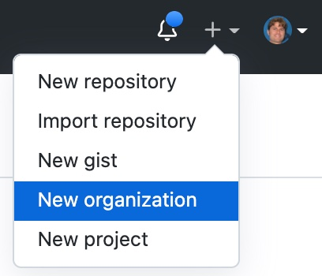
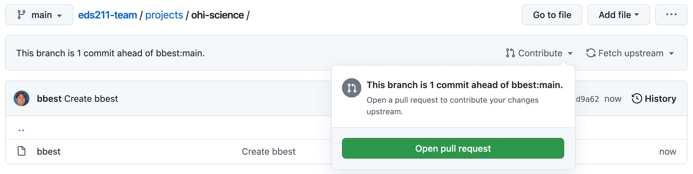
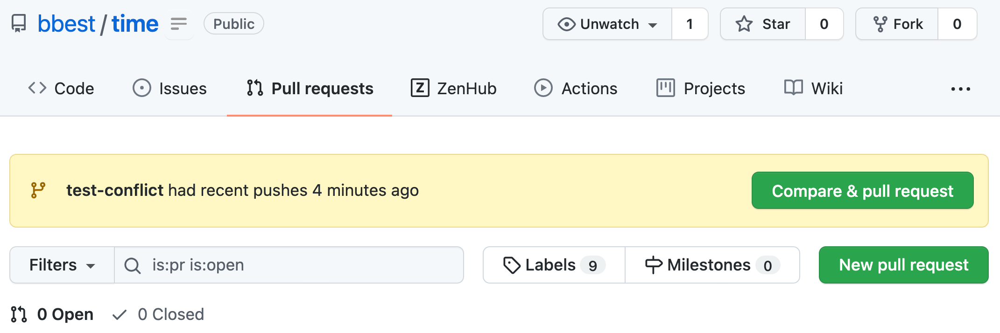
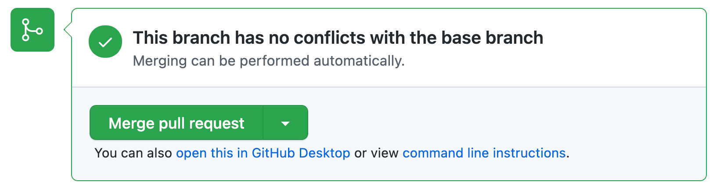
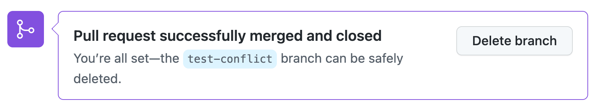
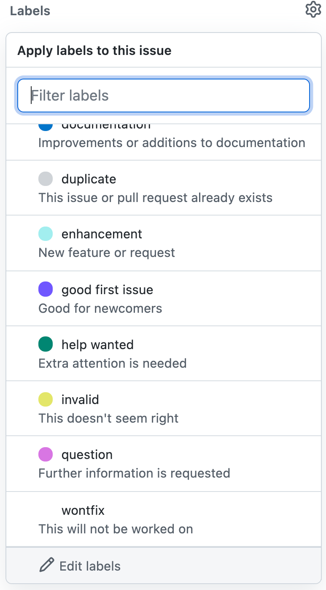

```{r setup, include=F}
knitr::opts_chunk$set(echo = F)
```

# Learning Objectives {.unnumbered}

1.  **Create a Github Org**. Create a new Github organization based on your Project Key (e.g. `ohi-science`). This will be your team's organization and repositories within for producing deliverables, including a website.

2.  **Fork Repo into Github Org**. Fork the template final project repository `EDS220_Fall2021_FinalProjInfofrom` from `samanthastevenson` into your organization. Forking makes a copy of the original repository into a new owner.

3.  **Understand Github Workflows**. A **Simple** workflow assumes you have read and write access to a repository. You can synchronize changed files (from using `git commit`) between your computer and Github by simply using `git push` and `git pull`. If you don't have write access, i.e. unable to perform a `git push`, then you need to make a copy of the repo with a `Github fork` into your own writable owner space, i.e. under your Github user or a Github organization to which you can write. This is the **Contribute** model and what powers contributions from community members in the open-source world. Even if you have write capabilities on the repository, you may wish to make a copy with `git branch` to avoid merge conflicts with others while you're working on some new feature or bug fix. This is the **Sandbox** model. Either the forked or branched copy can be synchronized with the original via a `pull request` from the contributor and a `merge` from the origin's owner.

4.  **Create & Share Website Repo using Github Pages**. The default website repo under a Github organization named exactly `{org}.github.io` is what gets served via the URL `https://{org}.github.io` once Github Pages gets turned on in the repo Settings. You've already done this in the MEDS program for your Github `{user}` space, i.e. `https://{user}.github.io`.

5.  **Build Rmarkdown Website**. This simple website uses a `_site.yml` file to apply consistent navigation bars and defaults to all pages. The original \*.Rmd files render to \*.html for serving online. The default web page for any folder is the `index.html`.

6.  **Contribute Workflow: Fork & Pull Request**. After you fork any public repo into your own space, you can make changes and contribute those back to the original repo with a `pull request`, which can then be incorporated with a `merge` by the original repo owner. This is how the open-source world works to incorporate code from the community. You'll use this technique to contribute towards a class directory of projects in the course repo `bbest/eds211-team`.

7.  **Sandbox Workflow: Branch & Merge**. Create a branch in RStudio and merge it in the Terminal.

8.  **Handle Merge Conflicts**. Conflicts are inevitable when collaborating with others, so knowing how to deal with them is a key part of the process. Git commits of two different users might operate on the same line(s) of code, which need to be reconciled when merging.


```{=html}
<!--
6.  Manage projects in Github with Issues and Project boards. Understand how to reference Issues (e.g. `#2`) in Github commit messages as well as mention other Github users (e.g. `@bbest`).

7.  Write markdown (e.g. `README.md`) to format text, and yaml (e.g. `_site.yml`) for configurations.

-   ...

-->
```
# Create Github organization [lead only]

The Github Organization you create will become the `{owner}` of the project's main `{repo}`. Remember, all of Github is organized according to `github.com/{owner}/{repo}`.

Have only one group project member follow instructions to [Create a new organization from scratch - GitHub Docs](https://docs.github.com/en/organizations/collaborating-with-groups-in-organizations/creating-a-new-organization-from-scratch). Even more simply, choose **+** and **New organization** from upper right of [github.com](https://github.com) once you're logged in:

{style="width:150px;"}

-   **Organization account name**:\
    This should be your Project Key from [EDS 211 - Lab 1. Proposal](https://bbest.github.io/eds211-team/lab1_proposal.html#create-group-project-key-and-title), e.g. `ohi-science`).

-   **Contact email**:\
    This should be the email associated with your Github account.

-   **This organization belongs to**:\
    Choose ***My personal account***.

-   **Add organization members**:\
    Add the Github usernames of the rest of your **team** plus instructors for both classes:

    -   `samanthastevenson` (EDS 220)
    -   `bbest` (EDS 211).

-   **What do you spend time on most day-to-day?**\
    I chose: Writing code and Planning projects.

-   **How many people do you expect to actively work within this GitHub organization?\
    **1 -5

-   **What type of work do you plan to use this organization for?\
    **Education projects

-   **What do you expect to do on GitHub in the next seven days?\
    **Collaborate on code; Plan and track work; Set up CI/CD\
    [[Continuous Integration](https://en.wikipedia.org/wiki/Continuous_integration) / [Continuous Delivery](https://en.wikipedia.org/wiki/Continuous_delivery) such as Github Action to automatically render Rmarkdown to html on website.]

-   **Do you have an existing repository for your project?\
    **No

## Edit All Invited People to make Owner [lead only]

Now the lead needs to visit the **People** tab of the organization, visit **Pending invitations** and make everyone an **Owner** (gear icon, Edit invitation, Owner, Update invitation).

## Accept invitations [all members]

All the rest of the team members need to accept the invitations, which can be done by directly visiting `https://github.com/{org}/{repo}/invitations`.

# Fork `samanthastevenson/{repo}` into `{org}/notebook` [lead only]

Next one person from your group will **fork** the template repo [samanthastevenson/EDS220_Fall2021_FinalProjInfofrom](https://github.com/samanthastevenson/EDS220_Fall2021_FinalProjInfofrom) where `{owner}` = `samanthastevenson` into your new Github organization (e.g. `{owner}` = `ohi-science` from Project Key of [EDS 211 - Lab 1. Proposal](https://bbest.github.io/eds211-team/lab1_proposal.html#create-group-project-key-and-title)).

Follow instructions from [Fork the repo - GitHub Docs](https://docs.github.com/en/get-started/quickstart/fork-a-repo):

-   **From**: `samanthastevenson/{repo}` <br> The template Python notebook repository [samanthastevenson/EDS220_Fall2021_FinalProjInfofrom](https://github.com/samanthastevenson/EDS220_Fall2021_FinalProjInfofrom) that Dr. Stevenson created for your Remote Sensing (EDS 220) group project.

-   **To**: `{org}/{repo}` <br> The organization should be what you created in the previous step.

Please **rename** the repo from `EDS220_Fall2021_FinalProjInfofrom` to `notebook`, which can be done under the repo's `r icons::fontawesome$solid$cog` Settings, Repository Name.

# Clone `{org}/notebook` onto your machine [all members]

Click on the RStudio **Terminal** pane where you enter shell commands to the operating system (*NOT* the RStudio **Console** where you enter R commands). Enter the following command to `git clone` the repo onto your machine.

``` {.bash}
# Change directory (cd) to where you want to store the repo on your machine
# Be sure that it is OUTSIDE any other repo
cd ~/github

# clone the repo onto your machine
git clone https://github.com/{org}/notebook.git
```

# Background: Github Workflows

```{r, include=FALSE}
knitr::opts_chunk$set(echo = TRUE)

if (!require(librarian)){
  install.packages("librarian")
  library(librarian)
}
shelf(
  htmltools, mitchelloharawild/icons)

# icons::download_fontawesome()
# devtools::load_all("~/github/bbest/icons")
# icons::download_octicons()
```

There are a variety of ways to interact with a Github repository, or **REPO** for short, which is a collection of files, possibly organized within folders. On Github every repo is associated with an **OWNER**, which can be a Github organization or a Github user. Repos are consistently found at **github.com/OWNER/REPO**.

If you have *write* permissions to the repo, then you can `git push` changes to it directly. These changes are always first packaged as a set of file differences by a `git commit` that requires a message.

If you do not have *write* permissions to the repo, then you need to `Github fork` that repo into your own user-writable space (user or organization). After you make changes to the files in your user-writable repo (with `git commit` and `git push`), you can then request those changes be pulled into the original repo with a `Github pull request`.

Furthermore, you can `git branch` a snapshot of the repo files into a *sandbox* for continuing to make changes, such as to fix a *bug* or implement a new *feature*. This branch won't affect the *main* branch until you're ready to `git merge` those changes, so it isolates development.

These aspects give rise to different *workflows* with increasing complexity that we'll incrementally try out with exercises, so you can become comfortable managing your own code, contributing to other open-source projects, and working on a set of code without trampling on other people's work.

```{r icons, echo=F}
icon_down   <- icons::fontawesome$solid$`arrow-down`
icon_up     <- icons::fontawesome$solid$`arrow-up`
icon_right  <- icons::fontawesome$solid$`arrow-right`
icon_cloud  <- icons::fontawesome$solid$cloud
icon_plus   <- icons::octicons$plus
icon_pc     <- icons::octicons$device_desktop
icon_dl     <- icons::octicons$download
icon_ul     <- icons::octicons$upload
icon_commit <- icons::octicons$git_commit
icon_pull   <- icons::fontawesome$solid$`cloud-download-alt`
icon_push   <- icons::fontawesome$solid$`cloud-upload-alt`
icon_merge  <- icons::octicons$git_merge
icon_fork   <- icons::octicons$repo_forked
icon_pr     <- icons::octicons$git_pull_request
icon_clone  <- icons::octicons$repo_clone
icon_branch <- icons::octicons$git_branch
```

## **Simple**: `push` & `pull`

The simplest workflow for tracking file changes is to simply `git push` changes into your Github repo, assuming you have *write* permissions to that repo. If you're working with anyone else or editing on more than one computer, then you'll want to `git pull` changes at the beginning of each session to capture changes and minimize potential *conflicts* before proceeding with any edits and subsequent `git commit` and `git push` commands.

The exact steps can be described in the table below. After the `Github create` repo step, you `git clone` it to get a copy of it onto your machine (with the hidden `.git` folder containing the configuration). Then you make changes on files and package differences with `git commit`, which requires a message every time and can happen offline. You'll need to be online to then run `git push` to publish those changes back to the Github repo. Then before subsequent changes, you'll want to update your machine with a `git pull`.\

| repo location                          |                                           initialize `r icon_down`                                            |                                                                 edit `r icon_up`                                                                  |                                update `r icon_down`                                |
|----------------------------------------|:-------------------------------------------------------------------------------------------------------------:|:-------------------------------------------------------------------------------------------------------------------------------------------------:|:----------------------------------------------------------------------------------:|
| `r icon_cloud` `github.com/OWNER/REPO` |                  [**create**](https://help.github.com/articles/create-a-repo/) `r icon_plus`                  |                                                                                                                                                   |                                                                                    |
| `r icon_pc` `~/github/REPO`            | [**clone**](https://help.github.com/articles/fetching-a-remote) `r icon_dl` `r HTML("&nbsp;")` `r icon_right` | [**commit**](http://git-scm.com/docs/git-commit) `r icon_commit`, [**push**](https://help.github.com/articles/pushing-to-a-remote/) `r icon_push` | [**pull**](https://help.github.com/articles/fetching-a-remote/#pull) `r icon_pull` |

## **Contribute**: `fork` & `pull request`

If you don't have *write* access to a Github repo, such as with any open-source project, then you can `Github fork` somebody else's repo into your own user-writable space (i.e. OWNER being a Github user or organization) where you have write permissions. There you can make changes (using `git commit` and `git push`). When you're ready to submit changes to the original repo, you make a `pull request` queuing these changes up for the owner(s) of the original repo to review and accept with a `merge`, reject or ignore. Github facilitates the conversation that may follow, including the ability to update the `pull request` before performing the final `merge`.

| repo location                          | `USER` permission |                                             initialize `r icon_down`                                             |                                                                 edit `r icon_up`                                                                  |                                                                              update `r icon_down`                                                                              |
|----------------------------------------|:-----------------:|:----------------------------------------------------------------------------------------------------------------:|:-------------------------------------------------------------------------------------------------------------------------------------------------:|:------------------------------------------------------------------------------------------------------------------------------------------------------------------------------:|
| `r icon_cloud` `github.com/OTHER/REPO` |     read only     |                                                                                                                  |                                [**merge**](https://help.github.com/articles/merging-a-pull-request) `r icon_merge`                                |                                                                                                                                                                                |
| `r icon_cloud` `github.com/OWNER/REPO` |   read + write    |                      [**fork**](https://help.github.com/articles/fork-a-repo) `r icon_fork`                      |                             [**pull request**](https://help.github.com/articles/creating-a-pull-request/) `r icon_pr`                             | [**pull request**](https://help.github.com/articles/creating-a-pull-request/) `r icon_pr`, [**merge**](https://help.github.com/articles/merging-a-pull-request) `r icon_merge` |
| `r icon_pc` `~/github/REPO`            |   read + write    | [**clone**](https://help.github.com/articles/fetching-a-remote) `r icon_clone` `r HTML("&nbsp;")` `r icon_right` | [**commit**](http://git-scm.com/docs/git-commit) `r icon_commit`, [**push**](https://help.github.com/articles/pushing-to-a-remote/) `r icon_push` |                                               [**pull**](https://help.github.com/articles/fetching-a-remote/#pull) `r icon_pull`                                               |

## **Sandbox**: `branch` & `merge`

Even if you're able to *write* directly to the repo, you may be collaborating with others and not want to step on their proverbial coding toes. By performing a `git branch`, you're taking a snapshot of the files and isolating them into your own *sandbox*. For instance let's say you're working on a new feature, then you might call your branch generically *new-feature*. Subsequent changes to the files in the Github repo (with `git commit` and `git push`) do not then affect the *main* branch until a `git merge` is executed to fold these changes of *new-feature* into the *main* branch.

| repo location                                         | `USER` permission |                                                initialize `r icon_down`                                                |                                                                               edit `r icon_up`                                                                                |                                update `r icon_down`                                |
|-------------------------------------------------------|:-----------------:|:----------------------------------------------------------------------------------------------------------------------:|:-----------------------------------------------------------------------------------------------------------------------------------------------------------------------------:|:----------------------------------------------------------------------------------:|
| `r icon_cloud` `github.com/OWNER/REPO` branch: *main* |   read + write    |                                                                                                                        |                                                                                                                                                                               |                                                                                    |
| `r icon_pc` `~/github/REPO` branch: *main*            |   read + write    |                     [**clone**](https://help.github.com/articles/fetching-a-remote) `r icon_clone`                     | [**merge**](https://www.atlassian.com/git/tutorials/using-branches/git-merge) `r icon_merge`, [**push**](https://help.github.com/articles/pushing-to-a-remote/) `r icon_push` |                                                                                    |
| `r icon_pc` `~/github/REPO` branch: *new-feature*     |   read + write    | [**branch**](https://www.atlassian.com/git/tutorials/using-branches) `r icon_branch` `r HTML("&nbsp;")` `r icon_right` |                                                       [**commit**](http://git-scm.com/docs/git-commit) `r icon_commit`                                                        | [**pull**](https://help.github.com/articles/fetching-a-remote/#pull) `r icon_pull` |

The scenario above shows the `branch` and `merge` happening locally, but you can also execute these on Github. The RStudio IDE provides the ability to create a new branch locally, but then to perform the `git merge` you need to do this in its Terminal.

## **Pro**: `branch`, `pull request` & `merge`

Extending the **Sandbox** workflow to full "professional" status, even if you have the administrative ability on the repo to perform a `git merge` you may wish to first advertise your proposed file changes to other contributors with a `pull request`. This then allows others to review and discuss changes before an admin then performs the final `git merge`. This is the recommended workflow described in [Understanding the GitHub flow · GitHub Guides](https://guides.github.com/introduction/flow/):

{style="width:600px"}

We want go over this entire workflow in this lesson, but it simply combines all the techniques above.

# Create website repo *{org}.github.io* [lead only]

Now one person from your group will create a Github repository for your project's website. [**Github Pages**](https://pages.github.com) uses owner/repository `{owner}/{owner}.github.io` to host the owner's website at `https://{owner}.github.io` where `{owner}` can be either a Github username or organization. All other repositories, i.e. `{owner}/{repo}`, can also have websites served via Github Pages as `https://{owner}.github.io/{repo}`.

This repo will contain the source code of an [Rmarkdown website](https://rmarkdown.rstudio.com/lesson-13.html) that will host the online landing site for your group project.

1.  With your web browser, sign into [Github.com](https://github.com) and visit your Github organization (i.e. `https://github.com/{org}`) and [Create a repository](https://help.github.com/articles/create-a-repo/) called `{org}.github.io`, where `{org}` is your Project Key from Lab 1.

{style="width:300px"}

Please tick the box to **Add a README file**, which gets generated from the **Description** you should also fill out with something like `group project website for [EDS 211](https://bbest.github.io/eds211-team)`. (Note the use of markdown for a link.)

You should now see this repo at `https://github.com/{org}/{org}.github.io`.

Notice that the only file in the repo so far is the `README.md`, which is in ***markdown*** format (`.md`) and its contents are displayed directly below, which is the special case for any `README.md` file in a Github folder. Clicking on the pencil icon to edit, reveals the source for this file.

Clicking on the **Preview** tab shows the formatted result. Note how the `#` is used to create a header.

For more on formatting text with markdown within Github, check out [Mastering Markdown · GitHub Guides](https://guides.github.com/features/mastering-markdown/).

## Create RStudio Project

Next, you'll use RStudio to initialize this website repo in two important ways:

1.  You'll let RStudio run `git clone` to copy the git repository onto your machine containing the `README.md` and importantly a hidden folder `.git/` which contains all file history and the configuration on where to synchronize files, i.e. Github.

2.  By creating an **RStudio Project**, you'll create an `{org}.github.io.Rproj` file. This will be an executable that you can double-click on from Windows Explorer or Mac Finder that will open RStudio and set the working directory to that containing folder. This assures that others who similarly open the project will start with the same working directory, so relative paths to other files in the repo will work regardless of where that repo lives on an individual machine. This is important for making your R code portable for others to use.

From **RStudio** menu **File** -\> **New Project...**

{style="width:500px"}

Choose **Version Control** -\> **git** and enter the **Repository URL** with the `.git` extension. This **Repository URL** is also easily copied into your clipboard from your web **browser** by clicking on the green Code button of your new repository (i.e. `https://github.com/{org}/{org}.github.io`):

{style="width:500px"}

Then paste (Ctrl + V) into the **Repository URL** field of the form.

I chose to Create the project as a subdirectory of `~/github` which means my home directory (`~`) and subfolder `github`, but you can create it wherever makes sense on your computer.

If it all works correctly then you should see the files downloaded and showing up in the **Files** pane of RStudio. If RStudio is configured correctly to work with **Git**, then you should also see a Git pane.

Besides the desired **RStudio Project** file `{org}.github.io.Rproj`, you should also see the `.gitignore`. This file describes files that `git` should ignore and so not prompt for asking whether to track with version control. If you open the `.gitignore` file in RStudio, you see it's a simple text file listing hidden files (i.e. those starting with a `.` and not normally shown in Windows Explorer or Mac Finder) that RStudio uses.

    .Rproj.user
    .Rhistory
    .RData
    .Ruserdata

## **Simple** `push`

Note that in the **Git** pane, the yellow box question marks under **Status** next to `.gitignore` and `{org}.github.io.Rproj` indicate these files are not known to the version control system (and asking should they be?). Ticking the boxes under **Staged** changes the **Status** to a turquoise `A` for added.

Now click the **Commit** button in the Git pane to open the Review Changes dialog window. Every commit requires a message.

Click the **Commit** button in the Review Changes dialog window. **Close** this dialog. Note how now "Your branch is ahead of 'origin/main' by 1 commit". The previous `git commit` operation happened only on the local machine. The "origin" is Github and "main" referring to the main branch.

Next, you need to **Push** these changes by clicking on the button in the upper right.

You should now see these two new files showing up in your repo at `https://github.com/{org}/{org}.github.io`. These files are displayed with the filename, most recent commit message associated with any changes and the time since last update.

## Create Rmarkdown website

Following guidance from [10.5 rmarkdown's site generator \| R Markdown: The Definitive Guide](https://bookdown.org/yihui/rmarkdown/rmarkdown-site.html), create a `_site.yml` by going to RStudio's menu **File** -\> **New File** -\> **Text File** and paste the following:

``` {.yaml}
name: "{org}"
navbar:
  title: "{org}"
  left:
    - text: "Home"
      href: index.html
    - text: "About"
      href: about.html
output_dir: "."
```

Be sure to replace `{org}` with your organization's Project Key, e.g. `ohi-science`. **Save** this file as `_site.yml`.

Next create your `index.Rmd` with this simple content:

``` {.markdown}
---
title: "Welcome"
---

Hello, Website!
```

Add another page `about.Rmd`:

``` {.markdown}
---
title: "About"
---

## Team Members

```

Finally, render the website by running the following in your R Console:

``` {.r}
rmarkdown::render_site()
```

You might need to install the package `rmarkdown`, which you can do from RStudio's **Packages** pane, **Install** button and typing "rmarkdown".

The **Viewer** pane now shows the rendered html. Also notice the unversioned files. Let's get these onto our Github repo by going into the **Git** pane like previously, ticking the **Staged** boxes, clicking **Commit**, adding a message like "initial website".

Click on **Commit** in the dialog. Close the Git Commit window and then click on **Push** so your branch is not ahead of the origin Github.

You should now see these new files showing up in your repo at `https://github.com/{org}/{org}.github.io`.

Next, let's get these files served as a website.

## Setup Github Pages to serve website

[Github Pages](https://pages.github.com) allows you to serve up simple websites from your Github repo. Let's turn on this feature by visiting the **Settings** tab in `https://github.com/{org}/{org}.github.io`. Then click the **Pages** menu from the left navbar, choose Branch: **main**, folder **/ (root)**.

Click **Save**. You should now see that the site is "ready to be published".

You should now be able to visit the website URL:

-   `https://{org}.github.io`

Notice how the URL is a subset of your Github repo URL:

-   `https://github.com/{org}/{org}.github.io`

For easily referencing the website, I recommend returning to the Github repo `https://github.com/{org}/{org}.github.io`, clicking the upper right **About** `r icons::fontawesome$solid$cog` and adding it to the **Website** entry.

You should now see a handy link to get to your website.

# **Contribute** to *eds211-team* [all members]

So far you've been using the **Simple** workflow to synchronize repos between Github and your local machine with `git push` and `git pull`. Next, you'll learn how to contribute towards a repo for which you don't have write permissions by performing a `fork` and `pull request`, i.e. the **Contribute** workflow.

You don't have write permissions to the */bbest/eds211-team* repo where these course materials are stored. The task is to **contribute** to this repo with the sparset amount of information, an empty file indicating your project organization on Github and your Github username under the existing `projects/` folder, eg `projects/ohi-science/bbest`.

To do so, please visit [github.com/bbest/eds211-team](https://github.com/bbest/eds211-team) and in the upper right, click `r icon_fork` **Fork** .

Next, choose your Github USER name as the owner into which this repo should be forked.

Notice how the URL changed from `github.com/bbest/eds211-team` to `github.com/{user}/eds211-team`.

You now have *write* permissions on this repo.

You could proceed with cloning the repo onto your local machine, making changes there with `git commit` and pushing to Github with `git push`, however we'll take care of this directly through Github web interface.

Visit the `projects/` folder of your forked repo. On the right click **Add file**, **Create new file**. Enter the *exact* name of your group project's Github organization (upper/lower case matters) and a forward slash (to denote a folder). Then add your *exact* Github username, e.g.:

{style="width:500px"} 

You do not need to enter anything in the content of the file. Simply click the green Commit new file button, which is the web equivalent of `git commit` (and `git push` since it's already on Github.com).

You'll notice that this branch is "1 commit ahead of eds211-team:main". Click on **Contribute**, **Open pull request**.

{style="width:500px"}

You should be taken to a screen asking for confirmation where you chould click on **Create pull request**. Normally, you'd leave a comment explaining what this pull request is for (but it's obvious enough in this case). Click on the final **Create pull request**. Now you should be taken to the origin [github.com/bbest/eds211-team](https://github.com/bbest/eds211-team) (*NOT* your {user} forked copy) and under the **Pull requests** see yours.

{style="width:500px"}

The image above shows a **Merge pull request** since I have admin privileges on this repo. You would *NOT* so would see it grayed out (or similar).

Good job! Nothing left for you to do except wait for me (as admin of this repo) to click on **Merge pull request**.

# **Sandbox** on *{org}.github.io* [all members]

Next, you'll level up your git skills by isolating development of your code in a new `branch`, which is like a **Sandbox** separate from the *main* branch. Your task is to simply add your name to the About page.

Please open your ***{org}.github.io.Rproj*** RStudio project where your website is hosted. Notice that in the upper right of RStudio you get **Project shortcuts** to quickly navigate to them. Or you could always double-click on the `*.Rproj` file from your file explorer application (Windows Explorer or Mac Finder).

In RStudio's **Git** pane click on the **New Branch** button and enter a **Branch Name** with your username, e.g. `add-bbest`:

{style="width:500px"}

Click **Create**. You should now see your new branch. Notice how when you click on the dropdown of branches you see both LOCAL and REMOTE: ORIGIN (as in on Github) versions.

Next, simply edit `about.Rmd` and add a bulleted list item with your name linked to your Github profile below `## Team Members`, e.g.:

``` {.md}
- [Ben Best](https://github.com/bbest)
```

Now you're ready to **Commit** and **Push** your changes. Once you've done that, please visit `https://{org}.github.io/{org}.github.io` with your web browser. Notice that `about.Rmd` is still the old Rmarkdown page without your name added. You simply need to select the `add-{user}` **branch** to see those files in their own little sandbox.

Returning to RStudio, you're ready to `git merge` the changes in the `rmd-website` branch to the `main` branch. In RStudio's **Git** pane switch back to the `main` branch.

RStudio doesn't provide a user interface to run the `git merge` command so you'll have to do this in RStudio's **Terminal** pane by entering:

``` {.bash}
# be sure to change this to your actual branch name
git merge add-{user}
```

You've now merged your LOCAL changes from the `add-{user}` branch to the `main` branch, and see in the **Git** pane that "Your branch is ahead of 'origin/main' by 1 commit." This means that you're ready to `git push` them to the ORIGIN on Github by running good ol' **Push**.

Now at last you should see these file changes showing up at `https://{org}.github.io/{org}.github.io`.

It might take a minute or so before they show up on your website at `https://{org}.github.io`. This is because Github Pages were originally designed to render static webpages with some templating capability (e.g. a common navigation menu) using [Jekyll](https://jekyllrb.com). To speed up rendering and disable Jekyll create an empty text file called `.nojekyll` in the source of the Github Pages folder, in this case the root folder of the repo. On a Mac, you can run this command in **Terminal**:

    touch .nojekyll

Be sure to **Commit** and **Push** these changes to Github.

# Handle Merge Conflict on Github [all members]

You can also perform a `merge` of a branch on Github with a `pull request` (vs previously more directly with `git merge` in the Terminal). If there's a conflict, Github provides a convenient text editor to resolve any conflicts. You will intentionally create a conflict between two branches and merge them on Github.

You'll use the `time` repo you created in [Lab 2. Time]( https://bbest.github.io/eds211-team/lab2_time.html#create-personal-github-repo) to play with handling a merge conflict.

## Create new branch `test-conflict` in `{user}/time` repo

Previously you created a new branch in RStudio GUI that sends the `git branch` command to the Terminal. Now you'll create a repo branch via Github. Let's use the personal repo `{user}/time` you created in [Lab 2](https://bbest.github.io/eds211-team/lab2_time.html#create-personal-github-repo).

Visit `https://github.com/{user}/time` in your web browser. To create a new branch click on the button with branches in the upper left of the default < > Code tab. The default branch selected is `main`. Enter `test-conflict` and select **Create branch: test conflict** from main: 

{style="width:500px"} 

## Insert `## Welcome` header in `test-conflict` branch

From the previous step you should notice getting switched over to the new branch `test-conflict` based on the branch selected dropdown in the upper left.

Click on `index.Rmd` and click the pencil icon to insert the following:

``` {.markdown}
## Welcome
```

Scroll down and notice enter a message under the **Commit changes** header of "+ Welcome":

{style="width:500px"} 
Click on the green **Commit changes** button. Since you're already on Github, you don't need to **Push**.

## Insert `## Hello` header in `main` branch

While still viewing the `index.Rmd` file in Github, switch to the `main` branch. You should notice that the `## Welcome` header is absent. 

Click on the pencil icon to insert a different greeting in the same location as the previous `## Welcome`:

``` {.markdown}
## Hello
```

Scroll down and notice enter a message under the **Commit changes** header of "+ Hello". Click on the green **Commit changes** button.

## Create **Pull Request**: `main` <- `test-conflict`

Now visit the **Pull requests** tab of your `time` repo. You might notice a suggestion to **Compare & pull request** the `test-conflict` branch since Github noticed recent changes there.

{style="width:500px"} 

So you know how to create one regardless of prompting, click on the **New pull request** button. 

{style="width:500px"}

Select the `test-conflict` branch. Notice how it says it **Can't automatically merge.**.

{style="width:500px"} 

Click **Create pull request**.  Let's give this pull request the title `Hello (main) <- Welcome (test-conflict)` to remind ourselves what's updating what. Because we intentionally created a conflict on the same line of code, you should see the following warning.

{style="width:500px"}
Click the button to **Resolve conflicts**.

{style="width:500px"}

Notice how you are now presented with files on the left pane and an editor to the right with highlighted lines to resolve and the ability to click on **Prev** and **Next** if we had multiple conflicts.

The conflicts are presented by comparing one branch starting with `<<<<<<< {branch1}` and ending with the other `>>>>>>> {branch2}` seperated by `=======`.

```
<<<<<<< test-conflict
## Welcome
=======
## Hello
>>>>>>> main
```

So if we want to go with the `## Welcome` header, reduce the lines above to simply:

```
## Welcome
```

And **Mark as resolved**. Then click on the green **Commit merge** button. You should then see the option to finally **Merge pull request**.

{style="width:500px"}

Click on **Merge pull request** and **Confirm merge**.

{style="width:500px"}

Congratulations! Finally delete the branch which is no longer needed.

# Use Github **Issues**

Next, you'll learn how to create and use [Github Issues](https://github.com/features/issues). Github Issues allow you to discuss tasks, whether fixing a bug or creating a feature, as a thread of comments. They can be assigned to Github users on your team and organized with labels, Milestones and Projects (up later).

## Create Issue in `{user}/time` [all members]

Please again visit your personal repo `https://github.com/{user}/time` that you created in [Lab 2](https://bbest.github.io/eds211-team/lab2_time.html#create-personal-github-repo). Click on the **Issues** tab and click the green **New issue** button.

Give it the following **Title**:

```
testing Github Issue features
```

And add the following into the initial **commment**:

```
## Github Issue Basics
- [x] Create an issue
- [x] Create this task list in initial comment of issue
- [ ] Convert the following two tasks into issues:
  - [ ] Assign user
  - [ ] Add new label
- [ ] Add emoji reaction to a comment

## Github Flavored Markdown in Issue Comments
- [ ] Paste a screenshot into a comment
- [ ] Reference lines of code with a canonical URL
- [ ] Add a fenced R code block
- [ ] Mention a Github user on your team
- [ ] Use emoji in a comment

## Reference Issues
- [ ] Mention in issue comment another issue that is in the same repo
- [ ] Mention in issue comment another issue that is in a different repo
- [ ] Mention in `git commit` message an issue in the same repo
```

Click the green button **Submit new issue**.

Please notice a couple things after you initially [Create a Github Issue](https://docs.github.com/en/issues/tracking-your-work-with-issues/creating-an-issue):

- You should see that the first issue you created here is `#2`, not `#1`. That's because **Pull Requests** in Github, including the one you created in Step [8.4 Create **Pull Request**: `main` <- `test-conflict`](#create-pull-request-main---test-conflict), count as a Github Issue. They similarly allow a conversation to happen between successive comments and possible code changes wrapped in git commits.

- The initial two tasks were already checked by using `- [x]` instead of `- [ ]`. You can reorder the items in the [Github Task List](https://docs.github.com/en/issues/tracking-your-work-with-issues/about-task-lists) by dragging items up/down, even between headers.

## Work through Tasks [all members]

Please next accomplish each task and check the task in the issue's list. Note the following:

- [ ] `Convert the following two tasks into issues:`. You can [convert a task to an issue](https://docs.github.com/en/issues/tracking-your-work-with-issues/creating-an-issue#creating-an-issue-from-a-task-list-item) by hovering over the task and clicking the [dot in a circle] icon in the upper-right corner of the task. 

- [ ] `Assign user`. When trying to [assign a Github User to an Issue](https://docs.github.com/en/issues/tracking-your-work-with-issues/assigning-issues-and-pull-requests-to-other-github-users) you won't have any users available in your `{user}/time` repo. Instead, you'll do this in your `{org}/notebook` repo later. So for this issue `Assign user` converted from a task, go ahead and assign the **label** `wontfix` and then **Close issue** with **comment** `Skipping for personal repo {user}/time. Doing later for {org}/notebook`. Then notice how in the task list of the original issue `testing Github Issue features` this task gets automatically checked by the converted issue's Closed status.

- [ ] `Add new label`. In this issue converted from a task, assign the Label (right side of issue) to `test` after you add it by editing the labels.
  
  {style="width:150px"}
- [ ] Add emoji reaction to one of your own comments. See [Add Reactions to Pull Requests, Issues, and Comments | The GitHub Blog](https://github.blog/2016-03-10-add-reactions-to-pull-requests-issues-and-comments/). \
  {style="width:500px"}

- [ ] `Paste a screenshot into a comment`. Hint: use keyboard shortcuts on [Mac](https://support.apple.com/en-us/HT201361) or [Windows](https://support.microsoft.com/en-us/windows/keyboard-shortcut-for-print-screen-601210c0-b3a9-7b58-bc40-bae4dcf5f108).

- [ ] `Reference lines of code with a canonical URL`. Highlight multiple lines from the `index.Rmd` in your `{user}/time` repo, such as the two lines of customized variable values under `# CHANGE THESE VARIABLES!`. Be sure to get the canonical URL referencing the specific git commit. The easiest way is using the `y` [Github keyboard shortcut](https://docs.github.com/en/get-started/using-github/keyboard-shortcuts#issues-and-pull-requests). Paste this URL in a new comment. Notice the lines of code show up in the comment. And these persist for this version (or git commit) even as subsequent git commits might change those lines (or even delete the file altogether).

- [ ] `Add a fenced R code block`. Add multiple lines of R code. See [Creating and highlighting code blocks - GitHub Docs](https://docs.github.com/en/github/writing-on-github/working-with-advanced-formatting/creating-and-highlighting-code-blocks#syntax-highlighting) and start with `r` after three backticks instead of `ruby`.

- [ ] `Mention a Github user on your team`. Add a comment referencing another Github user, e.g. `@bbest`, on your team. See [Mentioning people and teams](https://docs.github.com/en/github/writing-on-github/getting-started-with-writing-and-formatting-on-github/basic-writing-and-formatting-syntax#mentioning-people-and-teams).

- [ ] `Use emoji in a comment`. See [Basic writing and formatting syntax - GitHub Docs](https://docs.github.com/en/github/writing-on-github/getting-started-with-writing-and-formatting-on-github/basic-writing-and-formatting-syntax#using-emoji).
  {style="width:500px"}

- [ ] `Mention in issue comment another issue that is in the same repo`. Simply add in a new comment reference to another issue like `#3` . Notice how it gets linked and shows the title on hover.

- [ ] `Mention in issue comment another issue that is in a different repo`. now mention an issue in a different repo and different owner altogether, e.g. `bbest/eds211-team#21` prefixing with Github `{owner}/{repo}`. See [Autolinked references and URLs - GitHub Docs](https://docs.github.com/en/github/writing-on-github/working-with-advanced-formatting/autolinked-references-and-urls#issues-and-pull-requests).

- [ ] `Mention in git commit message issue in the same repo`. Make a change in your `index.Rmd`. It can be as simple as adding a newline or comment somewhere. Be sure to reference the issue # in your **git message**. Push it and notice how the commit appears in the thread of comments for the issue.

Once you've completed all these tasks, **Close the issue**. Congratulations!

## Create Issues from Project Tasks in `{org}/notebook` [lead only]

Coordinate amongst your project team the creation of Github Issues into `{org}/notebook` using your original project Tasks from the first lab. Then:

- Refine the **Title** of each task if something more specific is appropriate now.

- Detail with a **Task List** parts of the broader Task that could be broken up.

- **Convert to issues** those Task List items. By creating them this way they are associated with the original broader Task.

- **Assign users** to the issues.

- Include issues that are already complete and **Close** them, adding a screenshot, link, etc summarizing the progress.

# Create Github **Milestones** in `{org}/notebook` [lead only]

Milestones allow you to associate a deadline with a cluster of issues. A progress bar shows how many of the issues are closed versus still open. See [About milestones - GitHub Docs](https://docs.github.com/en/issues/using-labels-and-milestones-to-track-work/about-milestones).

{style="width:800px"}

Create Milestones per your original Lab 1 Deliverables with due dates. Change these to whatever is most appropriate for now.

Note that **Milestones** (an older feature) can only reference issues in the same repo, whereas a **Project** (a newer feature) can reference any repos with the same `{owner}`. This Milestones feature is expected to be superseded with a **Timeline** feature in Github  (per [mention](https://github.com/features/issues/) of "timelines (coming soon)") to probably provide something like a Gantt chart across repos.

# Use Github **Projects** (Beta) [lead only]

The new (Beta) Projects allow you to view your issues, even across repos in the same organization, either:

* as a **table**: \
  {style="width:800px"}

* or as a **board**: \
  {style="width:800px"}

The new **table** view adds grouping and sorting to the filtering of the existing **board** view, which is better for viewing prioritization vertically and time or stage horizontally. 

{style="width:800px"}

For more, see [About projects (beta) - GitHub Docs](https://docs.github.com/en/issues/trying-out-the-new-projects-experience/about-projects).

## Create Project (Beta) `Plan` under `{org}`

Create a project for your organization, so under `https://github.com/{org}` and **Projects**. 

{style="width:600px"}

## Customize the `Plan` Project 

See [Quickstart for projects (beta) - GitHub Docs](https://docs.github.com/en/issues/trying-out-the-new-projects-experience/quickstart) and follow the instructions there for:

- **Adding issues to your project**. Add all the issues you previously created.
- **Creating a field to track priority**. Note that you can similarly create any field and list of values to help organize your issues. \
  {style="width:200px"}
- **Grouping issues by priority**. This is a new **table** feature that allows you to simply drag and drop issues into a grouping thereby changing its field value to that group. \
  {style="width:700px"}
- **Saving the priority view**. You can create views with different groupings, filters and more, oh my!
- **Adding a board layout**. Be sure to set the **Status** field for each issue first.
  {style="width:700px"}

The original Project **board** may also be referred to as a [Kanban (Wikipedia)](https://en.wikipedia.org/wiki/Kanban_(development)), or "billboard" in Japanese. By prioritizing all issues vertically and sequencing them in time horizontally, any user can filter by **Assignee** and answer one of our core questions _What do I need to work on next?_

# Submit Lab via Form [all members]

Please submit the links to the Clockify project report and your personal time tracking website on Github via the following Google Form using your UCSB email:

- [Submission for Lab 3. Github](https://forms.gle/78ppr5Mmm6DuYuct5)

# Further Reading {.unnumbered}

## Git & Github {.unnumbered}

-   [GitHub Guides](https://guides.github.com/)
-   [Version Control with Git](http://swcarpentry.github.io/git-novice/)
-   [How to Use Git/GitHub with R](https://rfortherestofus.com/2021/02/how-to-use-git-github-with-r/)

### Markdown in Github

-   [Mastering Markdown · GitHub Guides](https://guides.github.com/features/mastering-markdown/).

## RStudio with Git & Github {.unnumbered}

-   [Happy Git and GitHub for the useR](https://happygitwithr.com/)
-   [Chapter 18 Git and GitHub \| R Packages](https://r-pkgs.org/git.html)
-   [Version Control with Git and SVN -- RStudio Support](https://support.rstudio.com/hc/en-us/articles/200532077-Version-Control-with-Git-and-SVN)
-   [Using RStudio Projects -- RStudio Support](https://support.rstudio.com/hc/en-us/articles/200526207-Using-Projects)

### Rmarkdown {.unnumbered}

-   [Lesson 1 \| Rmarkdown](https://rmarkdown.rstudio.com/lesson-1.html?_ga=2.141207218.1461543799.1623615738-155442495.1623419383)
-   [Getting started with R Markdown - RStudio](https://www.rstudio.com/resources/webinars/getting-started-with-r-markdown/)
-   [Reproducible Reporting - RStudio](https://www.rstudio.com/resources/webinars/reproducible-reporting/)
-   [R Markdown: The Definitive Guide](https://bookdown.org/yihui/rmarkdown/)

### Rmarkdown websites {.unnumbered}

-   [10.5 rmarkdown's site generator \| R Markdown: The Definitive Guide](https://bookdown.org/yihui/rmarkdown/rmarkdown-site.html)
-   [Creating websites in R](https://www.emilyzabor.com/tutorials/rmarkdown_websites_tutorial.html)
-   [Making free websites with RStudio's R Markdown](https://jules32.github.io/rmarkdown-website-tutorial/)
