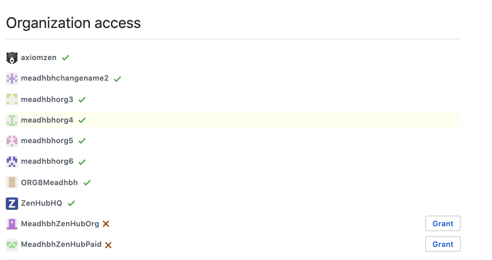
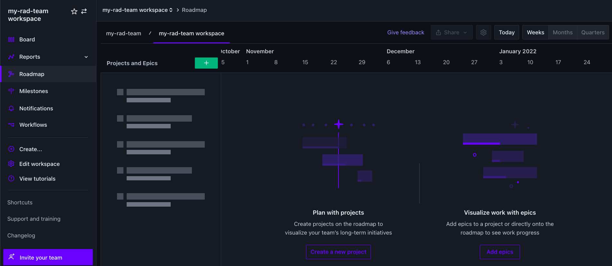
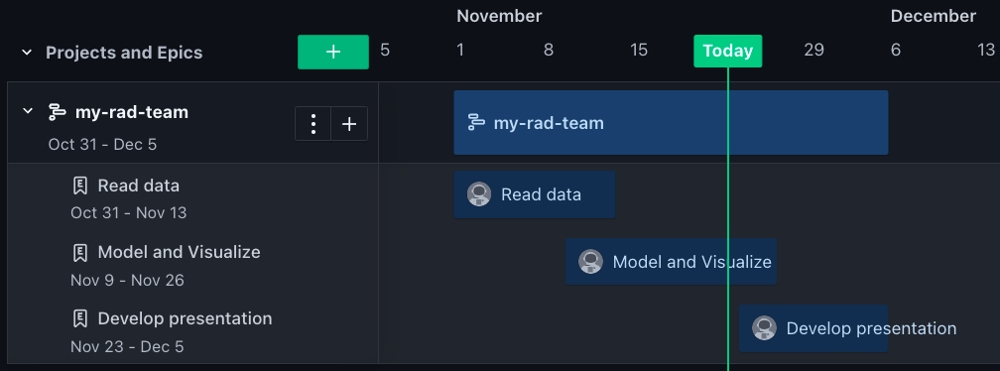
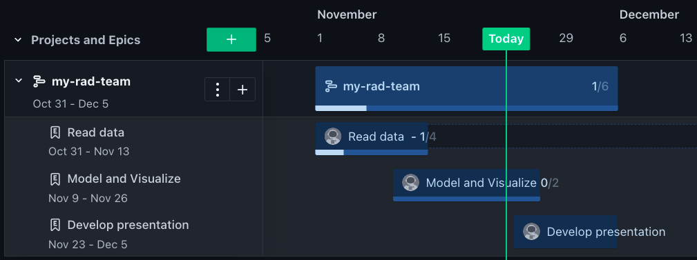

```{r setup, include=F}
knitr::opts_chunk$set(echo = F)
```

# Learning Objectives {.unnumbered}

1.  **Extend GitHub with ZenHub**. Until Github releases its forthcoming **Timeline** product, Zenhub extends Github functionality for free to create **Roadmaps** that provide a Gantt chart of a **Project** progress by **Epic**, which contain multiple Github **Issues**. Projects and Epics have start and end dates associated with them in the context of a larger **Workspace**, which is associated with a set of Github **Repos**.\
2.  **Cluster Issues into Epics**. By clustering Github Issues into Epics you can also communicate higher level project tasks and progress to non-technical stakeholders.\
3.  **Create Roadmap of Epics in Projects**. The Roadmap can only work interactively with team members logged into Zenhub (with their Github logins), but you can export the Roadmap as an image.\
4.  **Export Roadmap as image to display on web page**. This provides a public view of your project and progress.

# Create Zenhub Workspace [lead only]

Choose a member of your team with admin privileges to your Github organization. Visit [zenhub.com](https://www.zenhub.com), click on **Login** and **Log in using GitHub**.

Start off by creating a workspace, granting Zenhub access to Github repositories and inviting your team to the Zenhub workspace:

1.  [Grant ZenHub third-party access permissions in GitHub](https://help.zenhub.com/support/solutions/articles/43000010369-granting-third-party-access-in-github-for-zenhub#:~:text=Checking%20access%20permissions). Be sure to follow all instructions under **Checking access permissions** and for your Github profile (e.g. `@bbest`), i.e. `https://github.com/settings/applications`, to ensure your group project's Github organization has granted ZenHub permissions.\
    {width="700"}

2.  [Create your First Workspace](https://help.zenhub.com/support/solutions/articles/43000497224-creating-your-first-team-workspace). Create a workspace named after your Github org `{org} workspace`.\
    \
    {width="800"}\
    Note that the **Import Github Projects** option is only for the old Github Projects, not the new Github Projects Beta, so only **Add repos** when Creating a new ZenHub workspace. Be sure to first select your organization in the lower right.\
    {width="500"}\
    Upon creation of a workspace you are taken to the default Board view with all open issues in the connected repositories showing up under the **New Issues** pipeline.\
    {width="800"}\
    Note descriptions for the other pipelines like **Icebox** (low priority issues), **Product Backlog** (upcoming issues), **Sprint Backlog** (ready issues for sprint), **In Progress**, **Review/QA**, **Done**.

3.  [Invite your Team to ZenHub](https://help.zenhub.com/support/solutions/articles/43000035792-inviting-your-team-to-zenhub).\
    Be sure to invite me by sending link to `ben@ecoquants.com`. Otherwise I will not be able to view (and grade) your workspace.

# Create Roadmap

Click over to the Roadmap menu.

1.  **Create a new project**. You can give it the same name as your `{org}`. Set the dates to start from when your Lab 1 Gantt chart started, e.g. Nov 1 to Dec 5, 2021.\
    {width="800"}

2.  **Add epics** by clicking the plus sign `+` next to the project. Create epics that describe the major phases of the project and set start/end dates. To associate Closed issues with an Epic, you might wna\
    {width="800"}

3.  **Add issues to the epics** by going to the **Board**, selecting issues by clicking on the upper left avatar of the issue to select it and then the **Set epic** button.\
    \
    \
    clicking the linked name of the epic, and in the Epic view click the link to **Add issues to this Epic**.

Note that as issues close, the progress meter increments for the associated Epic and Project.



# Add Roadmap to Website

You can share a link to the roadmap, but only members of your team can view it. You can, however, export it as an image.

1.  **Export image** of Roadmap with the Share button and save as `images/roadmap.svg` in your `{org}.github.io` repo. You might want to prepend the date by a week to get it to show properly on export. \
    

2.  **Add Roadmap page to website**. Create a roadmap web page with this image. Add a menu item for Roadmap to your website. Hints:

    -   Use the markdown syntax for including an image `` in a new Rmarkdown `roadmap.Rmd`.

    -   Menu items are determined by your `_site.yml`. See: [10.5 rmarkdown's site generator \| R Markdown](%5Bhttps://bookdown.org/yihui/rmarkdown/rmarkdown-site.html)](<https://bookdown.org/yihui/rmarkdown/rmarkdown-site.html>)).

    -   You can rebuild the whole website by either: 1) clicking the Build Website button in the Build pane of RStudio; or 2) running `rmarkdown::render_site()` in the Console pane.

    -   Be sure to git push the website and ensure the new page is publicly accessible.

# Submit Lab

Please submit the links to the Zenhub Roadmap and your website page via the following Google Form using your UCSB email:

-   [Submission for Lab 4. Roadmap](https://forms.gle/BW9CDhL8PkbKy6BdA)

# Explore Further {.unnumbered}

-   [ZenHub Support](https://help.zenhub.com/support/home)

    -   [Creating GitHub Issue Dependencies using ZenHub](https://help.zenhub.com/support/solutions/articles/43000010349-create-github-issue-dependencies)
    
    -   [Let's Get Started](https://help.zenhub.com/support/solutions/43000361405)

    -   [Working with GitHub Issues and ZenHub Epics](https://help.zenhub.com/support/solutions/43000359263)

    -   [Project planning and sprint management](https://help.zenhub.com/support/solutions/43000359264)

    -   [Reports and gathering insights](https://help.zenhub.com/support/solutions/43000042876)

    -   [Creating your First Workspace](https://help.zenhub.com/support/solutions/articles/43000497224-creating-your-first-team-workspace)

    -   [Getting started with Epics in ZenHub](https://help.zenhub.com/support/solutions/articles/43000500733-getting-started-with-epics)

    -   [Using ZenHub Issues, Milestones, and Epics - YouTube](https://www.youtube.com/watch?v=tJ375ju3xTc)

    -   [Using ZenHub: Team Collaboration and Project Management in GitHub - YouTube](https://www.youtube.com/watch?v=FJBtFjZ55eY&list=PLFIGvQyXSp3CGS8X300Aj-hUZ-VLIhHbk)

    -   [Drive alignment across your organization with ZenHub Roadmaps](https://help.zenhub.com/support/solutions/articles/43000539465-an-introduction-to-zenhub-roadmaps)

    -   [Using ZenHub: Roadmaps - YouTube](https://www.youtube.com/watch?v=Yb_RFA74_GY)

    -   [Using ZenHub: Getting Started with GitHub Issues - YouTube](https://www.youtube.com/watch?v=yQlZFH_pcko&list=PLFIGvQyXSp3CGS8X300Aj-hUZ-VLIhHbk&index=7)

    -   [An Introduction to ZenHub Epics](https://help.zenhub.com/support/solutions/articles/43000010341-an-introduction-to-zenhub-epics)

    -   [Agile Concepts in GitHub and ZenHub](https://help.zenhub.com/support/solutions/articles/43000010338-agile-concepts-in-github-and-zenhub)

    -   [When to use Checklists, Issues and Epics](https://help.zenhub.com/support/solutions/articles/43000031151-when-to-use-checklists-issues-and-epics)

    -   [Using Velocity charts in ZenHub](https://help.zenhub.com/support/solutions/articles/43000010358)

    -   [Creating Burndown charts in ZenHub using GitHub Milestones](https://help.zenhub.com/support/solutions/articles/43000010356)
